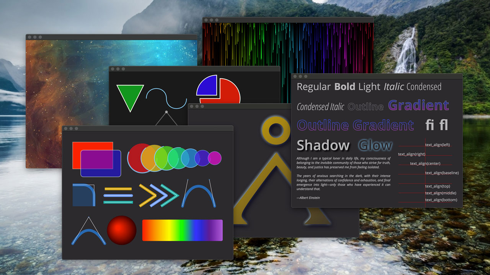

#  Artist 2D Canvas Library

## Introduction

The Artist 2D Canvas Library is an abstraction layer with an API inspired by
the HTML5 canvas API. The library presents a lean API modeled after the [HTML
Canvas 2D Context specification](https://www.w3.org/TR/2dcontext/). The API
is a not-so-thin layer above various 2D platform-specific and cross-platform
2D "backend" graphics libraries, such as [Skia](https://skia.org/) and
[Quartz-2D](https://apple.co/2SljYHw).

The Artist library goes beyond the basic HTML5 canvas API with extensions for
dealing with text layout and mechanisms for text editing, fonts and font
management, path creation and manipulation, and image capture and offscreen
graphics.

Artist is designed with these requirements in mind:

1. It should be open source with a liberal, non-viral license.
2. It should be very easy to build and incorporate in a target application,
   plugin, or library.
3. It should be ready for HDPI displays.
4. It should have a very lean and easy to use API, using modern C++, with
   standardized behavior across multiple platforms and graphics backend.
5. It should aim for high performance for smooth user-interaction in GUIs.
6. It should leverage modern graphic elements such as transparencies and path
   effects such as shadows and glows.

## News

* 20 March 2020: Initial port for Quartz-2D
* 31 March 2020: Initial port for Skia (MacOS)
* 5 April 2020: Ported to Win32 (SKia)
* 10 April 2020: Ported to Linux GTK3 (Skia)
* 27 April 2020: Started documentation.

## Documentation

Follow this link for the documentation: [The Artist 2D Canvas Library](https://cycfi.github.io/artist).

## Gallery

Follow this link for more screenshots: [Gallery](https://cycfi.github.io/artist/gallery).

## Setup and Installation

The Artist 2D Canvas Library is cross-platform. Artist currently supports the
MacOS, Windows and Linux. Follow the [Setup and Installation
guide](http://cycfi.github.io/artist/setup) to get started using the library.

## About the Author

Joel got into electronics and programming in the 80s because almost
everything in music, his first love, is becoming electronic and digital.
Since then, he builds his own guitars, effect boxes and synths. He enjoys
playing distortion-laden rock guitar, composes and produces his own music in
his home studio.

Joel de Guzman is the principal architect and engineer at [Cycfi
Research](https://www.cycfi.com/) and a consultant at [Ciere
Consulting](https://ciere.com/). He is a software engineer specializing in
advanced C++ and an advocate of Open Source. He has authored a number of
highly successful Open Source projects such as
[Boost.Spirit](http://tinyurl.com/ydhotlaf),
[Boost.Phoenix](http://tinyurl.com/y6vkeo5t) and
[Boost.Fusion](http://tinyurl.com/ybn5oq9v). These libraries are all part of
the [Boost Libraries](http://tinyurl.com/jubgged), a well respected,
peer-reviewed, Open Source, collaborative development effort.

-------------------------------------------------------------------------------

*Copyright (c) 2014-2020 Joel de Guzman. All rights reserved.*
*Distributed under the [MIT License](https://opensource.org/licenses/MIT)*
