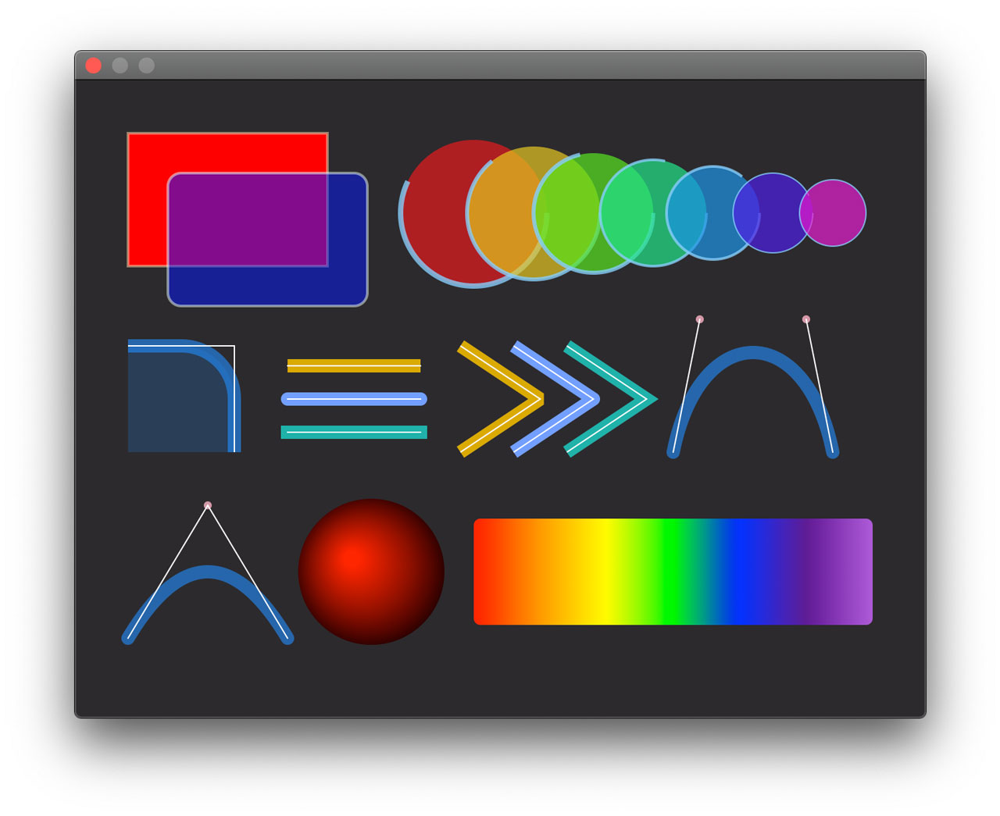
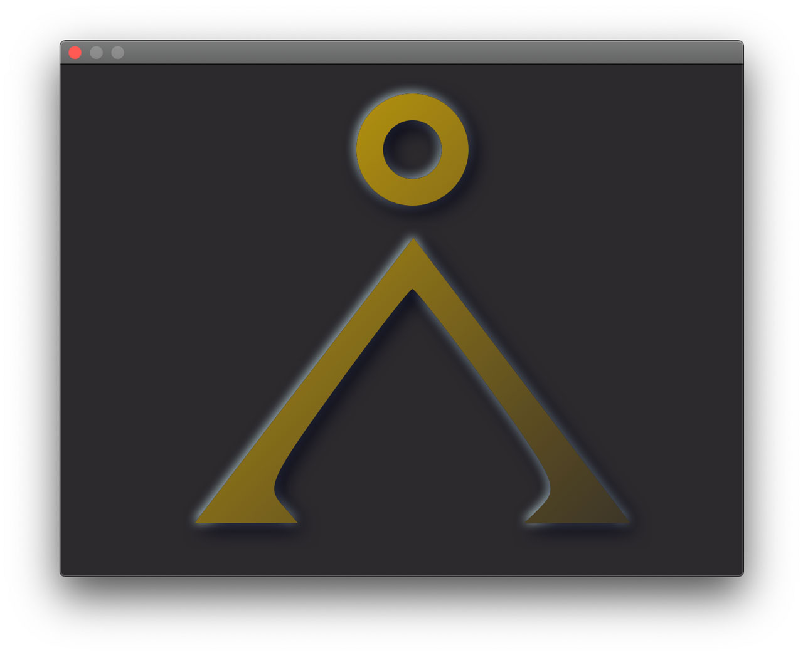
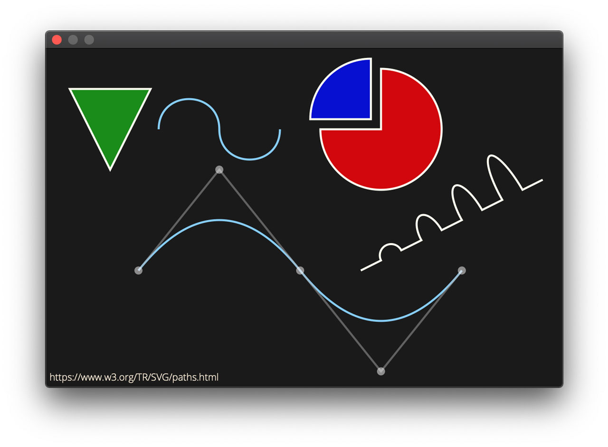
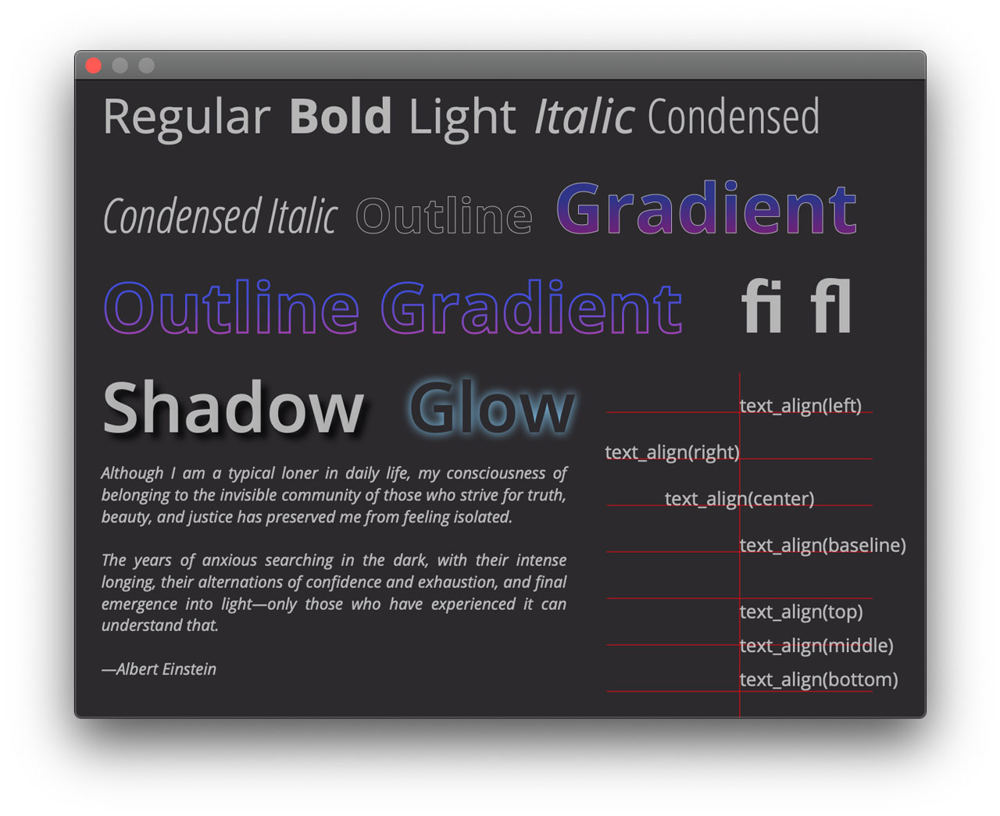
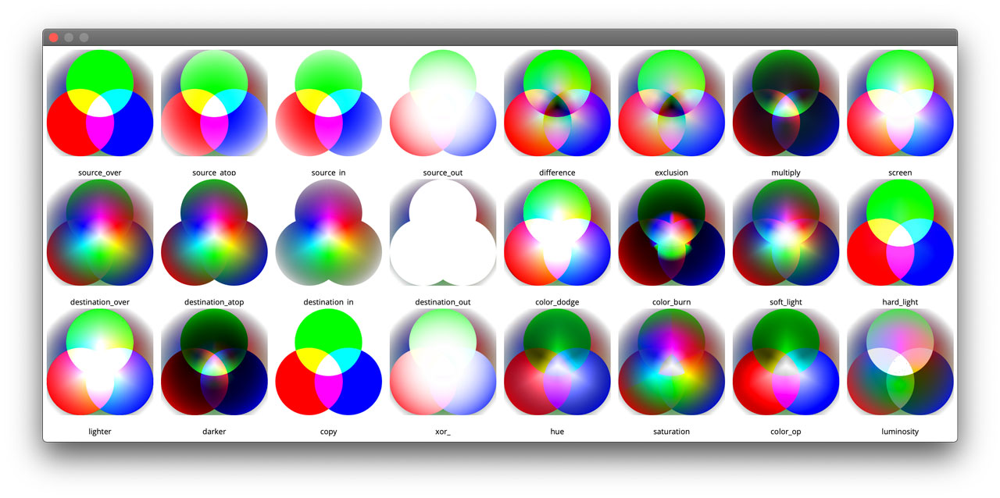

# Gallery

It’s always a nice to have some pretty pictures. Click to zoom into high-resolution (HiDPI) images or play the video clips.

  

  

  

  





  

-------------------------------------------------------------------------------

*Copyright (c) 2014-2020 Joel de Guzman. All rights reserved.*
*Distributed under the [MIT License](https://opensource.org/licenses/MIT)*
